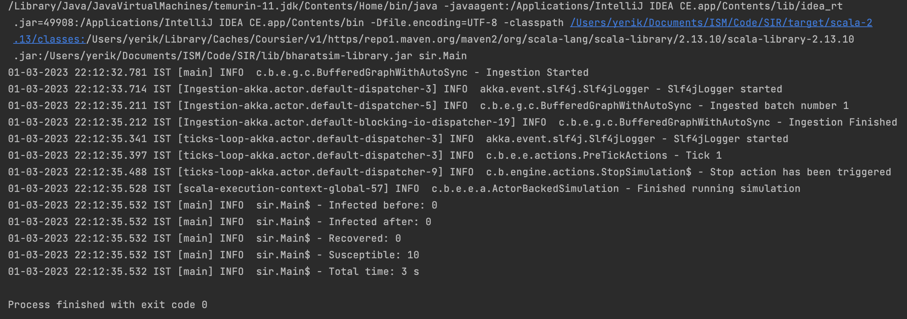

Introduction of Disease Dynamics
================================

In the previous section, while we defined all of the disease parameters, it had no effect on the population since we did not allow it to spread or die out. In this section, we allow the disease to propagate through a population and we output the changes in the population, such the number of individuals that have been recovered or number of infected individuals that remain after end time. Since the manner in which the disease interacts with an agent can now change as a function of location and time, we will have to update the ``Person`` class to account for this. Additionally, since we would like to record the different number of individuals in each compartment as the output for our simulation, we also need to define a new class that can record these details to an output file.

The Required Classes
^^^^^^^^^^^^^^^^^^^^

A new class called ``SIROutputSpec`` needs to be created and the ``Person`` class needs to be updated. 

.. tabs::

  .. group-tab:: Person.scala

    As mentioned earlier, this is the updated version of the class we have written earlier. In the previous version, we had only defined the relation and nothing else. The first thing to do is to add a schedule followed by checking the InfectedStatus of the individuals and the people around. The latter is done so we can look at the probability of getting infected and then do a coin toss with this probability to determine if the person in question does get infected.

    * numberOfTicksInADay is used to define how many ``Ticks`` a person experiences is a day. Since the duration of the infection (in days) is fixed, the ``numberOfTicksInADay`` will dictate the increments in the simulation. 
    * incrementInfectionDuration updates the day in the simulation. This is done after all the ticks have been completed in the day, and only after this can we move to the next day.
    * checkForInfection is a function that is used to check whether a susceptible individual gets infected. If the location is not empty, then the number of people present at that location are counted and are infected and this is stored as ``infectedNeighbourCount``. Using these value, an appropriate biased coin toss is done and if it comes ``True``, then the susceptible individual contracts the disease. The ``InfectionStatus`` will changed from susceptible to infected
    * checkForRecovery looks at infected individuals and if the last day for infection has been reached, then the ``InfectionStatus`` changes from ``Infected`` to ``Recovered``. 
    * isSusceptible, isInfected, isRecovered changes the infection status to ``Susceptible``, ``Infected``, ``Recovered`` respectively. 
    * decodeNode take the string and return the corresponding node.
    * We then add behaviour for each of the states.   

  .. group-tab:: SIROutputSpec.scala 

    This scala class specifies which headers of the data set is printed. 

    * getHeaders lists the headers of the outputs.
    * getRows function fetches the count of number of ``Susceptible``, ``Infected``, and ``Recovered`` at each time step. The counting is done by looking at each individual and retrieving their infection status and adding it up. 

.. tabs::

  .. code-tab:: scala Person.scala 

    package sir

    import com.bharatsim.engine.Context
    import com.bharatsim.engine.basicConversions.decoders.DefaultDecoders._
    import com.bharatsim.engine.basicConversions.encoders.DefaultEncoders._
    import com.bharatsim.engine.graph.GraphNode
    import com.bharatsim.engine.models.{Agent, Node}
    import com.bharatsim.engine.utils.Probability.toss
    import sir.InfectionStatus._

    case class Person(id: Long, age: Int, infectionState: InfectionStatus, infectionDay: Int) extends Agent {
      final val numberOfTicksInADay: Int = 24
      private val incrementInfectionDuration: Context => Unit = (context: Context) => {
        if (isInfected && context.getCurrentStep % numberOfTicksInADay == 0) { 
          updateParam("infectionDay", infectionDay + 1)
        }
      }
      private val checkForInfection: Context => Unit = (context: Context) => {
        if (isSusceptible) {
          val infectionRate = Disease.beta

          val schedule = context.fetchScheduleFor(this).get

          val currentStep = context.getCurrentStep
          val placeType: String = schedule.getForStep(currentStep)

          val places = getConnections(getRelation(placeType).get).toList

          if (places.nonEmpty) {
            val place = places.head
            val decodedPlace = decodeNode(placeType, place) 

            val infectedNeighbourCount = decodedPlace
              .getConnections(decodedPlace.getRelation[Person]().get) 
              .count(x => x.as[Person].isInfected)

            val shouldInfect = toss(infectionRate, infectedNeighbourCount) 
            if (shouldInfect) {
              updateParam("infectionState", Infected) 
            }
          }
        }
      }

      private val checkForRecovery: Context => Unit = (context: Context) => {
        if (isInfected && infectionDay == Disease.lastDay
        )
          updateParam("infectionState", Removed)
      }

      def isSusceptible: Boolean = infectionState == Susceptible

      def isInfected: Boolean = infectionState == Infected

      def isRecovered: Boolean = infectionState == Removed

      
      private def decodeNode(classType: String, node: GraphNode): Node = {
        classType match {
          case "House" => node.as[House]
        }
      }
      
      addBehaviour(incrementInfectionDuration)
      addBehaviour(checkForInfection)
      addBehaviour(checkForRecovery)

      addRelation[House]("STAYS_AT")
    }

 
  .. code-tab:: scala SIROutputSpec.scala 

    package sir

    import com.bharatsim.engine.Context
    import com.bharatsim.engine.graph.patternMatcher.MatchCondition._
    import com.bharatsim.engine.listeners.CSVSpecs
    import com.bharatsim.examples.epidemiology.sir.InfectionStatus.{Susceptible, Infected, Removed}

    class SIROutputSpec(context: Context) extends CSVSpecs {
      override def getHeaders: List[String] =
        List(
          "Step",
          "Susceptible",
          "Infected",
          "Removed"
        )

      override def getRows(): List[List[Any]] = {
        val graphProvider = context.graphProvider
        val label = "Person"
        val row = List(
          context.getCurrentStep,
          graphProvider.fetchCount(label, "infectionState" equ Susceptible),
          graphProvider.fetchCount(label, "infectionState" equ Infected),
          graphProvider.fetchCount(label, "infectionState" equ Removed)
        )
        List(row)
      }
    }   

.. _Writing output to file:

Writing output to a file
^^^^^^^^^^^^^^^^^^^^^^^^

Now we have imported a population and set up basics for the disease. It is time we implement the disease and print the output. First we need to import the following addition files, 

.. code-block:: scala

  import sir.InfectionStatus._
  import com.bharatsim.engine.{Context, Day, Hour, ScheduleUnit}
  import com.bharatsim.engine.actions.StopSimulation
  import com.bharatsim.engine.listeners.{CsvOutputGenerator, SimulationListenerRegistry}
  import com.bharatsim.engine.models.Agent
  import java.util.Date
  import com.bharatsim.engine.basicConversions.decoders.DefaultDecoders._
  import com.bharatsim.engine.graph.patternMatcher.MatchCondition._
  import com.bharatsim.engine.dsl.SyntaxHelpers._

After we ingest the data in the main function, we need to define the Simulation and the end point of the Simulation. ``registerAgent[Person]`` explicitly mentions that the individual of the person class is an agent in the system. Once we define the output location, we can actually run the simulation followed by printing the results, and finally saving the data as a csv file.

.. code-block:: scala

    def main(args: Array[String]): Unit = {

      var beforeCount = 0
      val simulation = Simulation()

      simulation.ingestData(implicit context => {
        ingestCSVData("citizen10k.csv", csvDataExtractor)
        logger.debug("Ingestion done")
      })

      simulation.defineSimulation(implicit context => {

        createSchedules()

        registerAction(
          StopSimulation,
          (c: Context) => {
            getInfectedCount(c) == 0
          }
        )

        beforeCount = getInfectedCount(context)

        registerAgent[Person]

        val currentTime = new Date().getTime

        SimulationListenerRegistry.register(
          new CsvOutputGenerator("src/main" + currentTime + ".csv", new SIROutputSpec(context))
        )
      })

      simulation.onCompleteSimulation { implicit context =>
        printStats(beforeCount)
        teardown()
      }

      val startTime = System.currentTimeMillis()
      simulation.run()
      val endTime = System.currentTimeMillis()
      logger.info("Total time: {} s", (endTime - startTime) / 1000)
    }

In the ``defineSimulation``, we call upon a function called ``createSchedules``. The following piece of code will define this function

.. code-block:: scala 

    private def createSchedules()(implicit context: Context): Unit = {
      val allSchedule = (Day, Hour)
        .add[House](0, 23)

      registerSchedules(
        (allSchedule, (agent: Agent, _: Context) => agent.asInstanceOf[Person].age > 0, 1),
      )
    }

.. note:: ``add[House](0,23)`` means that we are creating a 24 hour schedule associated with the location ``House``. In the framework, 0 to 0 is counted as 1 hour.

``printStats`` simply prints the values in the output message window and it finds these values by calling user defined like ``getSusceptibleCount``. These functions look at the node on the graph and then count the people present in the node. 

.. code-block:: scala 
    
  private def printStats(beforeCount: Int)(implicit context: Context): Unit = {
    val afterCountSusceptible = getSusceptibleCount(context)
    val afterCountInfected = getInfectedCount(context)
    val afterCountRecovered = getRemovedCount(context)

    logger.info("Infected before: {}", beforeCount)
    logger.info("Infected after: {}", afterCountInfected)
    logger.info("Recovered: {}", afterCountRecovered)
    logger.info("Susceptible: {}", afterCountSusceptible)
  }

  private def getSusceptibleCount(context: Context) = {
    context.graphProvider.fetchCount("Person", "infectionState" equ Susceptible)
  }

  private def getInfectedCount(context: Context): Int = {
    context.graphProvider.fetchCount("Person", ("infectionState" equ Infected))
  }

  private def getRemovedCount(context: Context) = {
    context.graphProvider.fetchCount("Person", "infectionState" equ Removed)
  }

On Compiling everything together, the whole code looks like the following

.. code-block:: scala

  package sir
  import com.bharatsim.engine.Context
  import com.bharatsim.engine.ContextBuilder._
  import com.bharatsim.engine.execution.Simulation
  import com.bharatsim.engine.graph.ingestion.{GraphData, Relation}
  import com.typesafe.scalalogging.LazyLogging
  import com.bharatsim.engine.utils.Probability.biasedCoinToss
  import com.bharatsim.engine.basicConversions.encoders.DefaultEncoders._
  import sir.InfectionStatus._
  import com.bharatsim.engine.{Context, Day, Hour, ScheduleUnit}
  import com.bharatsim.engine.actions.StopSimulation
  import com.bharatsim.engine.listeners.{CsvOutputGenerator, SimulationListenerRegistry}
  import com.bharatsim.engine.models.Agent
  import java.util.Date
  import com.bharatsim.engine.basicConversions.decoders.DefaultDecoders._
  import com.bharatsim.engine.graph.patternMatcher.MatchCondition._
  import com.bharatsim.engine.dsl.SyntaxHelpers._

  object Main extends LazyLogging{
    private val initialInfectedFraction = 0.01

    def main(args: Array[String]): Unit = {

      var beforeCount = 0
      val simulation = Simulation()

      simulation.ingestData(implicit context => {
        ingestCSVData("citizen10k.csv", csvDataExtractor)
        logger.debug("Ingestion done")
      })
      simulation.defineSimulation(implicit context => {

        createSchedules()

        registerAction(
          StopSimulation,
          (c: Context) => {
            getInfectedCount(c) == 0
          }
        )

        beforeCount = getInfectedCount(context)

        registerAgent[Person]

        val currentTime = new Date().getTime

        SimulationListenerRegistry.register(
          new CsvOutputGenerator("src/main" + currentTime + ".csv", new SIROutputSpec(context))
        )
      })

      simulation.onCompleteSimulation { implicit context =>
        printStats(beforeCount)
        teardown()
      }

      val startTime = System.currentTimeMillis()
      simulation.run()
      val endTime = System.currentTimeMillis()
      logger.info("Total time: {} s", (endTime - startTime) / 1000)
    }

    private def createSchedules()(implicit context: Context): Unit = {
      val allSchedule = (Day, Hour)
        .add[House](0, 23)

      registerSchedules(
        (allSchedule, (agent: Agent, _: Context) => agent.asInstanceOf[Person].age > 0, 1),
      )
    }
    private def csvDataExtractor(map: Map[String, String])(implicit context: Context): GraphData = {

      val citizenId = map("Agent_ID").toLong
      val age = map("Age").toInt
      val homeId = map("HHID").toLong

      val initialInfectionState = if (biasedCoinToss(initialInfectedFraction)) "Infected" else "Susceptible"

      val citizen: Person = Person(
        citizenId,
        age,
        InfectionStatus.withName(initialInfectionState),
        0
      )

      val home = House(homeId)
      val staysAt = Relation[Person, House](citizenId, "STAYS_AT", homeId)
      val memberOf = Relation[House, Person](homeId, "HOUSES", citizenId)

      val graphData = GraphData()
      graphData.addNode(citizenId, citizen)
      graphData.addNode(homeId, home)
      graphData.addRelations(staysAt, memberOf)

      graphData
    }

    private def printStats(beforeCount: Int)(implicit context: Context): Unit = {
      val afterCountSusceptible = getSusceptibleCount(context)
      val afterCountInfected = getInfectedCount(context)
      val afterCountRecovered = getRemovedCount(context)

      logger.info("Infected before: {}", beforeCount)
      logger.info("Infected after: {}", afterCountInfected)
      logger.info("Recovered: {}", afterCountRecovered)
      logger.info("Susceptible: {}", afterCountSusceptible)
    }

    private def getSusceptibleCount(context: Context) = {
      context.graphProvider.fetchCount("Person", "infectionState" equ Susceptible)
    }

    private def getInfectedCount(context: Context): Int = {
      context.graphProvider.fetchCount("Person", ("infectionState" equ Infected))
    }

    private def getRemovedCount(context: Context) = {
      context.graphProvider.fetchCount("Person", "infectionState" equ Removed)
    }
  }

The output message on running the code is 

