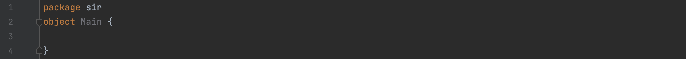
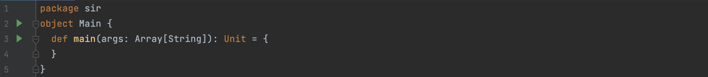

Writing your First Program
==========================

This section is a detailed guide for a novice user on how to build a `SIR Model <https://bharatsim.readthedocs.io/en/latest/epidemiology-sir-model.html>`_ in BharatSim from scratch. By the end of this section, you should be able to write and execute a SIR model by yourself.

Any model built on this framework contains various classes which are essentially extensions of different `Nodes <https://bharatsim.readthedocs.io/en/latest/epidemiology.html>`_ . To build a SIR model from scratch, one needs to define the said classes and the properties and relationships associated with them. In the basic SIR there are two main components:

1. `Agents <https://bharatsim.readthedocs.io/en/latest/epidemiology.html>`_ 
2. `Network <https://bharatsim.readthedocs.io/en/latest/epidemiology.html>`_ 

Agents are simply the individuals in the population and the Network is a class that defines a node that multiple agents frequent. Network classes can be used to model -- for example -- physical locations where different Agents come in contact with one another.

Here, we begin writing our program assuming that every agent is in contact with every other agent, which is equivalent to all of them being in the same "location".

Single Location SIR
-------------------

This section will look at the disease progress in a single location and observe its dynamics. 

Creating an Empty Class
^^^^^^^^^^^^^^^^^^^^^^^
Create a new project in the required directory. There is no need to create a new folder, as creating a new project automatically creates a new folder. Name this folder ``sir`` and change the language to scala. The build system should be chosen to be sbt. 

Navigate to ``src\main\scala`` and right click on the folder in IntelliJ. Select a new package and rename it sir. Again right click on sir package, select a Scala class followed by object. Call this object ``Main``. 

The empty class should look like this. 

Now we can define a main function that has no input and has no output. The syntax and indentation of defining a function is as follows

.. code-block:: scala

    def main(args: Array[String]): Unit = {
    }

The ``args`` means that the argument or the input is an array of Strings and the output is of type ``Unit``, which corresponds to void means that there is no output. The code should look like this, 

.. note:: void return means that the function returns nothing at all. Remember nothing is different from 0, or empty list. 

.. note:: Notice how the object Main has changed color from grey to white. This is an IntelliJ feature which lets the user know if the object/class/variable is being used

On running this, the output message should read ``Process finished with exit code 0``

The Required Classes
^^^^^^^^^^^^^^^^^^^^

Before we can input a file or simulate a disease, we need to make a few classes which are essential to the workings of the framework. These classes need to be imported to the main class to make the code easier to understand and clutter-free. The framework is extremely inter-connected and defining the same functions over and over again is tedious and computationally heavy. 

.. tabs::

  .. group-tab:: InfectionStatus.scala

    InfectionStatus class is a scala object class that stores the compartments of the disease, and in our case Susceptible, Infected, and Recovered. This class connects the instance of the compartments to the their string counterparts. 

    * BasicDecoder: This functions takes a string value and converts it to either a node or throws an exception. The latter is only the case when the input type is not in form of a string. 
    * BasicEncoder: This takes the instance and converts it to a string. In the simple case, there are three possibilities which are ``Susceptible``, ``Infected`` and ``Recovered``
    * Extends: This allows the functions of one class to be used in another. In this case, the functions of Enumeration are made available in the class InfectedStatus because of ``extends``

  .. group-tab:: Disease.scala

    Much like ``InfectionStatus``, this is also a scala object class and this stores the characteristics of the disease; the beta value and the when the infection will end. 

    * Final val: this value can not be over-written in any other class or function. 

    A disease is defined by beta and how long it lasts (for further information, refer to `Epidemiology  <https://bharatsim.readthedocs.io/en/latest/epidemiology.html>`_), and final val makes sure that the defining characteristics of the disease does not change during the course of the simulation. 

  .. group-tab:: House.scala

    This is scala case class that is a stores the locations of the individuals which are the part of the network. Since there is only one location, then only one class is required to define the location.

    * addRelation: connects the individuals to the location or in this case the House. On further expanding the locations, we will keep addings relationships in different classes. 
    * Person: It is a class defining the agent (or individual) in this simulation. 

  .. group-tab:: Person.scala

    This is also a scala case class. This class decribes the behaviours of the individuals in the ``Network``, how their schedule looks like, the manner in which they can get infected and recovered. Since this is a simple case, only the relationship should be taken care of.

    * ``Age`` and ``Infection`` day are of type Int. There are only a limited number of values these variables can take and hence datatype Int will be suffice.
    * The data type of ``ID`` is long since there are many citizens and larger data space is required than Int and hence long is used. 

The code for each of the above class is provided below. 

.. tabs::

  .. code-tab:: scala InfectionStatus.scala

    package sir
    import com.bharatsim.engine.basicConversions.StringValue
    import com.bharatsim.engine.basicConversions.decoders.BasicDecoder
    import com.bharatsim.engine.basicConversions.encoders.BasicEncoder

    object InfectionStatus extends Enumeration {
      type InfectionStatus = Value
      val Susceptible, Infected, Removed = Value

      implicit val infectionStatusDecoder: BasicDecoder[InfectionStatus] = {
        case StringValue(v) => withName(v)
        case _ => throw new RuntimeException("Infection status was not stored as a string")
      }

      implicit val infectionStatusEncoder: BasicEncoder[InfectionStatus] = {
        case Susceptible => StringValue("Susceptible")
        case Infected => StringValue("Infected")
        case Removed => StringValue("Removed")
      }
    }

  .. code-tab:: scala Disease.scala 

    package sir

    object Disease {
      final val beta: Double = 0.3
      final val lastDay: Int = 12
    }

  .. code-tab:: scala House.scala

    package sir
    import com.bharatsim.engine.models.Network

    case class House(id: Long) extends Network {
      addRelation[Person]("HOUSES")

      override def getContactProbability(): Double = 1
    }

  .. code-tab:: scala Person.scala

    package sir

    import com.bharatsim.engine.models.{Agent, Node}
    import sir.InfectionStatus._

    case class Person(id: Long, age: Int, infectionState: InfectionStatus, infectionDay: Int) extends Agent {

      addRelation[House]("STAYS_AT")
    }

Inputting a File
^^^^^^^^^^^^^^^^

To begin we must import a series of libraries and the function of each libraries will be explained as and when they are required. 

.. code-block:: scala

  import com.bharatsim.engine.Context
  import com.bharatsim.engine.ContextBuilder._
  import com.bharatsim.engine.execution.Simulation
  import com.bharatsim.engine.graph.ingestion.{GraphData, Relation}
  import com.typesafe.scalalogging.LazyLogging
  import com.bharatsim.engine.utils.Probability.biasedCoinToss
  import com.bharatsim.engine.basicConversions.encoders.DefaultEncoders._

There needs to be a modification in the line where we have defined the object. We need to make use of a keywork called ``extends`` which allows one class to inherit the properties of another class. 

.. code-block:: scala

  object Main extends LazyLogging

By extending ``LazyLogging``, all the properties of this class are made available in ``Main``. The ``LazyLogging`` class allows the user to display or output information. It can be thought of as better version of ``SystemOut``.

.. note:: When libraries or variables are not being used they appear grey in color, and as soon as they are called, they become colored again

Since ``LazyLogging`` is being used, it changes color from grey. 

The next step is to define a private value called ``initialInfectedFraction`` and set it to 0.01. Private value means that this will only be available in the defining class and not outside. This will be made accessible to the function we are about to define. 

In the main function we had earlier defined, we can create an instance of the simulation class. 

.. code-block:: scala 

  val simulation = Simulation()

.. note:: val is an immutable variable and this implies that the value of this can not change. 

Then we ingest the csv file in the following manner 

.. code-block:: scala

  simulation.ingestData(implicit context => {
  ingestCSVData("input.csv", csvDataExtractor) 
  logger.debug("Ingestion done")
  })

Here ``csvDataExtractor`` is a user defined function which we will get to later. 

On running the code, an error pops up displaying that ``csvDataExtractor`` is not defined. 

The ``csvDataExtractor`` function is defined in the following manner

.. code-block:: scala
  
  private def csvDataExtractor(map: Map[String, String])(implicit context: Context): GraphData = {
  }

Once the function is defined and we need it to the following things, 

1. `Accept the Context as an input parameter`
2. `CSV header and corresponding values`
3. `Return the data in the form of GraphData`

The first step depends on the CSV file that is being imported since it depends on the headers of the data. In BharatSim, the CSV files usually have the following columns, 

.. code-block:: scala

    val citizenId = map("Agent_ID").toLong
    val age = map("Age").toInt
    val homeId = map("HHID").toLong

.. note:: The csvDataExtractor reads the csv file line by line and defines each citizen line by line. 

The next step is to determine if the citizen imported is infected or not. 

.. code-block:: scala

  val initialInfectionState = if (biasedCoinToss(initialInfectedFraction)) "Infected" else "Susceptible"
  
If the ``biasedCoinToss`` returns true, then the citizen analyzed is infected from the disease. Using the data obtained from the CSV file and the infection state, we can create an instance of the citizen.

.. code-block:: scala

    val citizen: Person = Person(
    citizenId,
    age,
    InfectionStatus.withName(initialInfectionState),
    0
    )

Once this is done, ``relationships`` need to be established that will connect the nodes on the graph. The citizen will ``Stay At`` the house, and the house will ``House`` the citizen. The ``relationship`` needs to be established both the ways, as the first relationship links the citizen node to the house node and the second one links the house node to the citizen one. 

.. code-block:: scala
  
  val home = House(homeId)
  val staysAt = Relation[Person, House](citizenId, "STAYS_AT", homeId)
  val memberOf = Relation[House, Person](homeId, "HOUSES", citizenId)

.. note:: A House “HOUSES” an Agent and an Agent “STAYS_AT” a House so these two relations are inherently reflections of each other. The first relation is specified in the House class, while the second one is specified in the Person class (Refer to the classes above). The same defination of relationships can be extended to any pair of Agents (Student, Employer) and corresponding locations (School, Office). 

Then we create an instance of the ``GraphData`` and add the aforementioned nodes and relationships

.. code-block:: scala

  val graphData = GraphData()
  graphData.addNode(citizenId, citizen)
  graphData.addNode(homeId, home)
  graphData.addRelations(staysAt, memberOf)

Once the nodes and relationships have been established, we can then return the ``GraphData``. Unlike python, no return keywork is actually required. In scala, the last line has to be just value that has to be returned. 

.. code-block:: scala

  graphData

Compiling all the lines together, the ``csvDataExtractor`` function and the main function looks like 

.. code-block:: scala

  def main(args: Array[String]): Unit = {

    var beforeCount = 0
    val simulation = Simulation()

    simulation.ingestData(implicit context => {
      ingestCSVData("citizen10k.csv", csvDataExtractor)
      logger.debug("Ingestion done")
    })

  private def csvDataExtractor(map: Map[String, String])(implicit context: Context): GraphData = {

    val citizenId = map("Agent_ID").toLong
    val age = map("Age").toInt
    val homeId = map("HHID").toLong

    val initialInfectionState = if (biasedCoinToss(initialInfectedFraction)) "Infected" else "Susceptible"

    val citizen: Person = Person(
      citizenId,
      age,
      InfectionStatus.withName(initialInfectionState),
      0
    )

    val home = House(homeId)
    val staysAt = Relation[Person, House](citizenId, "STAYS_AT", homeId)
    val memberOf = Relation[House, Person](homeId, "HOUSES", citizenId)

    val graphData = GraphData()
    graphData.addNode(citizenId, citizen)
    graphData.addNode(homeId, home)
    graphData.addRelations(staysAt, memberOf)

    graphData
  }

Introduction of Disease Dynamics
--------------------------------

In the previous section, we had a disease for the name sake but it must be noted that the disease was not allowed to spread or die out. In this section, we allow the disease to propogate through a population and we output the changes in the population, such the number of individuals that have been recovered or number of infected individuals that remain after end time. Since the manner in which the disease is interacting with the agent is changing, we will have to update the ``Person.scala`` class and add a new class to dictate the outputs. 

The Required Classes
^^^^^^^^^^^^^^^^^^^^

A new class called ``SIROutputSpec`` needs to be created and the ``Person`` class needs to be updated. 

.. tabs::

  .. group-tab:: SIROutputSpec.scala 

    This scala class specifies which headers of the data set is printed. 

    * getHeaders lists the headers of the outputs.
    * getRows function fetches the count of number of Susceptible, Infected, and Recovered at each time step. The counting is done by looking at each individual and retrieving their infection status and adding it up. 

  .. group-tab:: Person.scala

    As mentioned earlier, this is the updated version of the class we have written earlier. In the previous version, we had only defined the relation and nothing else. The first thing to do is to add a schedule followed by checking the InfectedStatus of the individuals and the people around. The latter is done so we can look at the probability of getting infected and then do a coin toss with this probability to determine if the person in question does get infected.

    * numberOfTicksInADay is used to define how many ``Ticks`` a person experiences is a day. Since the duration of the infection (in days) is fixed, the ``numberOfTicksInADay`` will dictate the increments in the simulation. 
    * incrementInfectionDuration updates the day in the simulation. This is done after all the ticks have been completed in the day, and only after this can we move to the next day.
    * checkForInfection is a function that is used to check whether a susceptible individual gets infected. If the location is not empty, then the number of people present at that location are counted and are infected and this is stored as ``infectedNeighbourCount``. Using these value, an appropriate biased coin toss is done and if it comes ``True``, then the susceptible individual contracts the disease. The ``InfectionStatus`` will changed from susceptible to infected
    * checkForRecovery looks at infected individuals and if the last day for infection has been reached, then the ``InfectionStatus`` changes from ``Infected`` to ``Recovered``. 
    * isSusceptible, isInfected, isRecovered changes the infection status to ``Susceptible``, ``Infected``, ``Recovered`` respectively. 
    * decodeNode take the string and return the corresponding node.
    * We then add behaviour for each of the states. 

.. tabs::

  .. code-tab:: scala SIROutputSpec.scala 

    package sir

    import com.bharatsim.engine.Context
    import com.bharatsim.engine.graph.patternMatcher.MatchCondition._
    import com.bharatsim.engine.listeners.CSVSpecs
    import com.bharatsim.examples.epidemiology.sir.InfectionStatus.{Susceptible, Infected, Removed}

    class SIROutputSpec(context: Context) extends CSVSpecs {
      override def getHeaders: List[String] =
        List(
          "Step",
          "Susceptible",
          "Infected",
          "Removed"
        )

      override def getRows(): List[List[Any]] = {
        val graphProvider = context.graphProvider
        val label = "Person"
        val row = List(
          context.getCurrentStep,
          graphProvider.fetchCount(label, "infectionState" equ Susceptible),
          graphProvider.fetchCount(label, "infectionState" equ Infected),
          graphProvider.fetchCount(label, "infectionState" equ Removed)
        )
        List(row)
      }
    }

  .. code-tab:: scala Person.scala 

    package sir

    import com.bharatsim.engine.Context
    import com.bharatsim.engine.basicConversions.decoders.DefaultDecoders._
    import com.bharatsim.engine.basicConversions.encoders.DefaultEncoders._
    import com.bharatsim.engine.graph.GraphNode
    import com.bharatsim.engine.models.{Agent, Node}
    import com.bharatsim.engine.utils.Probability.toss
    import sir.InfectionStatus._

    case class Person(id: Long, age: Int, infectionState: InfectionStatus, infectionDay: Int) extends Agent {
      final val numberOfTicksInADay: Int = 24
      private val incrementInfectionDuration: Context => Unit = (context: Context) => {
        if (isInfected && context.getCurrentStep % numberOfTicksInADay == 0) { 
          updateParam("infectionDay", infectionDay + 1)
        }
      }
      private val checkForInfection: Context => Unit = (context: Context) => {
        if (isSusceptible) {
          val infectionRate = Disease.beta

          val schedule = context.fetchScheduleFor(this).get

          val currentStep = context.getCurrentStep
          val placeType: String = schedule.getForStep(currentStep)

          val places = getConnections(getRelation(placeType).get).toList

          if (places.nonEmpty) {
            val place = places.head
            val decodedPlace = decodeNode(placeType, place) 

            val infectedNeighbourCount = decodedPlace
              .getConnections(decodedPlace.getRelation[Person]().get) 
              .count(x => x.as[Person].isInfected)

            val shouldInfect = toss(infectionRate, infectedNeighbourCount) 
            if (shouldInfect) {
              updateParam("infectionState", Infected) 
            }
          }
        }
      }

      private val checkForRecovery: Context => Unit = (context: Context) => {
        if (isInfected && infectionDay == Disease.lastDay
        )
          updateParam("infectionState", Removed)
      }

      def isSusceptible: Boolean = infectionState == Susceptible

      def isInfected: Boolean = infectionState == Infected

      def isRecovered: Boolean = infectionState == Removed

      
      private def decodeNode(classType: String, node: GraphNode): Node = {
        classType match {
          case "House" => node.as[House]
        }
      }
      
      addBehaviour(incrementInfectionDuration)
      addBehaviour(checkForInfection)
      addBehaviour(checkForRecovery)

      addRelation[House]("STAYS_AT")
    }

Outputting a File
^^^^^^^^^^^^^^^^^

Now we have imported a population and set up basics for the disease. It is time we implement the disease and print the output. First we need to import the following addition files, 

.. code-block:: scala

  import sir.InfectionStatus._
  import com.bharatsim.engine.{Context, Day, Hour, ScheduleUnit}
  import com.bharatsim.engine.actions.StopSimulation
  import com.bharatsim.engine.listeners.{CsvOutputGenerator, SimulationListenerRegistry}
  import com.bharatsim.engine.models.Agent
  import java.util.Date
  import com.bharatsim.engine.basicConversions.decoders.DefaultDecoders._
  import com.bharatsim.engine.graph.patternMatcher.MatchCondition._
  import com.bharatsim.engine.dsl.SyntaxHelpers._

After we ingest the data in the main function, we need to define the Simulation and the end point of the Simulation. ``registerAgent[Person]`` explicitly mentions that the individual of the person class is an agent in the system. Once we define the output location, we can actually run the simulation followed by printing the results, and finally saving the data as a csv file.

.. code-block:: scala

    def main(args: Array[String]): Unit = {

      var beforeCount = 0
      val simulation = Simulation()

      simulation.ingestData(implicit context => {
        ingestCSVData("citizen10k.csv", csvDataExtractor)
        logger.debug("Ingestion done")
      })

      simulation.defineSimulation(implicit context => {

        createSchedules()

        registerAction(
          StopSimulation,
          (c: Context) => {
            getInfectedCount(c) == 0
          }
        )

        beforeCount = getInfectedCount(context)

        registerAgent[Person]

        val currentTime = new Date().getTime

        SimulationListenerRegistry.register(
          new CsvOutputGenerator("src/main" + currentTime + ".csv", new SIROutputSpec(context))
        )
      })

      simulation.onCompleteSimulation { implicit context =>
        printStats(beforeCount)
        teardown()
      }

      val startTime = System.currentTimeMillis()
      simulation.run()
      val endTime = System.currentTimeMillis()
      logger.info("Total time: {} s", (endTime - startTime) / 1000)
    }

In the ``defineSimulation``, we call upon a function called ``createSchedules``. The following piece of code will define this function

.. code-block:: scala 

    private def createSchedules()(implicit context: Context): Unit = {
      val allSchedule = (Day, Hour)
        .add[House](0, 23)

      registerSchedules(
        (allSchedule, (agent: Agent, _: Context) => agent.asInstanceOf[Person].age > 0, 1),
      )
    }

.. note:: ``add[House](0,23)`` means that we are creating a 24 hour schedule associated with the location House. In the framework, 0 to 0 is counted as 1 hour.

``printStats`` simply prints the values in the output message window and it finds these values by calling user defined like ``getSusceptibleCount``. These functions look at the node on the graph and then count the people present in the node. 

.. code-block:: scala 
    
  private def printStats(beforeCount: Int)(implicit context: Context): Unit = {
    val afterCountSusceptible = getSusceptibleCount(context)
    val afterCountInfected = getInfectedCount(context)
    val afterCountRecovered = getRemovedCount(context)

    logger.info("Infected before: {}", beforeCount)
    logger.info("Infected after: {}", afterCountInfected)
    logger.info("Recovered: {}", afterCountRecovered)
    logger.info("Susceptible: {}", afterCountSusceptible)
  }

  private def getSusceptibleCount(context: Context) = {
    context.graphProvider.fetchCount("Person", "infectionState" equ Susceptible)
  }

  private def getInfectedCount(context: Context): Int = {
    context.graphProvider.fetchCount("Person", ("infectionState" equ Infected))
  }

  private def getRemovedCount(context: Context) = {
    context.graphProvider.fetchCount("Person", "infectionState" equ Removed)
  }

On Compiling everything together, the whole code looks like the following

.. code-block:: scala

  package sir
  import com.bharatsim.engine.Context
  import com.bharatsim.engine.ContextBuilder._
  import com.bharatsim.engine.execution.Simulation
  import com.bharatsim.engine.graph.ingestion.{GraphData, Relation}
  import com.typesafe.scalalogging.LazyLogging
  import com.bharatsim.engine.utils.Probability.biasedCoinToss
  import com.bharatsim.engine.basicConversions.encoders.DefaultEncoders._
  import sir.InfectionStatus._
  import com.bharatsim.engine.{Context, Day, Hour, ScheduleUnit}
  import com.bharatsim.engine.actions.StopSimulation
  import com.bharatsim.engine.listeners.{CsvOutputGenerator, SimulationListenerRegistry}
  import com.bharatsim.engine.models.Agent
  import java.util.Date
  import com.bharatsim.engine.basicConversions.decoders.DefaultDecoders._
  import com.bharatsim.engine.graph.patternMatcher.MatchCondition._
  import com.bharatsim.engine.dsl.SyntaxHelpers._

  object Main extends LazyLogging{
    private val initialInfectedFraction = 0.01

    def main(args: Array[String]): Unit = {

      var beforeCount = 0
      val simulation = Simulation()

      simulation.ingestData(implicit context => {
        ingestCSVData("citizen10k.csv", csvDataExtractor)
        logger.debug("Ingestion done")
      })
      simulation.defineSimulation(implicit context => {

        createSchedules()

        registerAction(
          StopSimulation,
          (c: Context) => {
            getInfectedCount(c) == 0
          }
        )

        beforeCount = getInfectedCount(context)

        registerAgent[Person]

        val currentTime = new Date().getTime

        SimulationListenerRegistry.register(
          new CsvOutputGenerator("src/main" + currentTime + ".csv", new SIROutputSpec(context))
        )
      })

      simulation.onCompleteSimulation { implicit context =>
        printStats(beforeCount)
        teardown()
      }

      val startTime = System.currentTimeMillis()
      simulation.run()
      val endTime = System.currentTimeMillis()
      logger.info("Total time: {} s", (endTime - startTime) / 1000)
    }

    private def createSchedules()(implicit context: Context): Unit = {
      val allSchedule = (Day, Hour)
        .add[House](0, 23)

      registerSchedules(
        (allSchedule, (agent: Agent, _: Context) => agent.asInstanceOf[Person].age > 0, 1),
      )
    }
    private def csvDataExtractor(map: Map[String, String])(implicit context: Context): GraphData = {

      val citizenId = map("Agent_ID").toLong
      val age = map("Age").toInt
      val homeId = map("HHID").toLong

      val initialInfectionState = if (biasedCoinToss(initialInfectedFraction)) "Infected" else "Susceptible"

      val citizen: Person = Person(
        citizenId,
        age,
        InfectionStatus.withName(initialInfectionState),
        0
      )

      val home = House(homeId)
      val staysAt = Relation[Person, House](citizenId, "STAYS_AT", homeId)
      val memberOf = Relation[House, Person](homeId, "HOUSES", citizenId)

      val graphData = GraphData()
      graphData.addNode(citizenId, citizen)
      graphData.addNode(homeId, home)
      graphData.addRelations(staysAt, memberOf)

      graphData
    }

    private def printStats(beforeCount: Int)(implicit context: Context): Unit = {
      val afterCountSusceptible = getSusceptibleCount(context)
      val afterCountInfected = getInfectedCount(context)
      val afterCountRecovered = getRemovedCount(context)

      logger.info("Infected before: {}", beforeCount)
      logger.info("Infected after: {}", afterCountInfected)
      logger.info("Recovered: {}", afterCountRecovered)
      logger.info("Susceptible: {}", afterCountSusceptible)
    }

    private def getSusceptibleCount(context: Context) = {
      context.graphProvider.fetchCount("Person", "infectionState" equ Susceptible)
    }

    private def getInfectedCount(context: Context): Int = {
      context.graphProvider.fetchCount("Person", ("infectionState" equ Infected))
    }

    private def getRemovedCount(context: Context) = {
      context.graphProvider.fetchCount("Person", "infectionState" equ Removed)
    }
  }

The output message on running the code is 

.. image:: _static/images/OutputFile_msg.png

Expanding the Network
---------------------

Ealier we had one location which was the ``House``. In this section we increase the locations to ``House``,  ``Office``, and ``School``. Every person has a unique house and either a Office or a School and this categorized on the basis of age. 

The Required Classes
^^^^^^^^^^^^^^^^^^^^

As mention while creating the ``House.scala`` class, we mentioned that each of the locations will require a separate class. In addition to the new location classes, the person class needs to updated to establish the relationships. 

.. tabs::

  .. group-tab:: Office.scala 

    This scala class defines the relationship betweeen the agent of type ``Person`` and ``Office``.  Again since there are numerous offices, the datatype required is Long. 

  .. group-tab:: School.scala

    This scala class defines the relationship betweeen the agent of type ``Person`` and ``School``.  Again since there are numerous schools, the datatype required is Long. 

  .. group-tab:: Person.scala 

    This is the same as last class we defined but now we have to add relationships that corresponds to the relationships define in the Network classes earlier. 

.. tabs::
  
  .. code-tab:: scala Office.scala

    package sir

    import com.bharatsim.engine.models.Network

    case class Office(id: Long) extends Network {
      addRelation[Person]("EMPLOYER_OF")

      override def getContactProbability(): Double = 1
    }

  .. code-tab:: scala School.scala 

    package sir

    import com.bharatsim.engine.models.Network

    case class School(id: Long) extends Network {
      addRelation[Person]("TEACHES")

      override def getContactProbability(): Double = 1
    }

  .. code-tab:: scala Person.scala 

    package sir

    import com.bharatsim.engine.Context
    import com.bharatsim.engine.basicConversions.decoders.DefaultDecoders._
    import com.bharatsim.engine.basicConversions.encoders.DefaultEncoders._
    import com.bharatsim.engine.graph.GraphNode
    import com.bharatsim.engine.models.{Agent, Node}
    import com.bharatsim.engine.utils.Probability.toss
    import com.bharatsim.examples.epidemiology.sir.InfectionStatus._

    case class Person(id: Long, age: Int, infectionState: InfectionStatus, infectionDay: Int) extends Agent {
      final val numberOfTicksInADay: Int = 24
      private val incrementInfectionDuration: Context => Unit = (context: Context) => {
        if (isInfected && context.getCurrentStep % numberOfTicksInADay == 0) { 
          updateParam("infectionDay", infectionDay + 1)
        }
      }
      private val checkForInfection: Context => Unit = (context: Context) => {
        if (isSusceptible) { 
          val infectionRate = Disease.beta 

          val schedule = context.fetchScheduleFor(this).get

          val currentStep = context.getCurrentStep
          val placeType: String = schedule.getForStep(currentStep)

          val places = getConnections(getRelation(placeType).get).toList
          if (places.nonEmpty) {
            val place = places.head
            val decodedPlace = decodeNode(placeType, place) 

            val infectedNeighbourCount = decodedPlace
              .getConnections(decodedPlace.getRelation[Person]().get) 
              .count(x => x.as[Person].isInfected)

            val shouldInfect = toss(infectionRate, infectedNeighbourCount) 
            if (shouldInfect) {
              updateParam("infectionState", Infected) 
            }
          }
        }
      }

      private val checkForRecovery: Context => Unit = (context: Context) => {
        if (isInfected && infectionDay == Disease.lastDay 
        ) 
          updateParam("infectionState", Removed)
      }

      def isSusceptible: Boolean = infectionState == Susceptible

      def isInfected: Boolean = infectionState == Infected

      def isRecovered: Boolean = infectionState == Removed

      private def decodeNode(classType: String, node: GraphNode): Node = {
        classType match {
          case "House" => node.as[House]
          case "Office" => node.as[Office]
          case "School" => node.as[School]
        }
      }
      addBehaviour(incrementInfectionDuration)
      addBehaviour(checkForInfection)
      addBehaviour(checkForRecovery)

      addRelation[House]("STAYS_AT")
      addRelation[Office]("WORKS_AT")
      addRelation[School]("STUDIES_AT")
    }

Implementation
^^^^^^^^^^^^^^

The main file doesnt need major alterations, but the changes that have to be implemented are crucial conceptually and for the program to give the correct output. The majority of the changes are in two areas which are

* Categorization of people: We have different locations in the network but only one type of Person. We need to make a distinction and categorize the individuals to send them to different locations. In this section, the categorization is done on the basis of age; any over the age of 18 works in an office and anyone under the age of 18 goes to a school. After creating these different people, we need to define the relationship between the people and their respective nodes. All these changes are made in the csvDataExtractor. 

.. note:: The age of the citizens are provided in the input csv file. 

* createSchedules: Now that we have defined office-goers and school-goers, we need to decide their schedules and timings. 

The csvDataExtractor function is the same and changes are made after the nodes (house, citizen) and relationship (house and person) is defined. Regardless of the age of the individual, they still have a house that they are associated to and therefore no changes are required when defining the aforementioned nodes and relationships. The next part is adding new nodes and relationships for individuals and their additional network and this is rather straightforward. An if condition is used to categorize on the basis of age and in the conditional block the relationships and nodes are added, similar to the house and citizen case. 

.. code-block:: scala 

    if (age >= 18) {
      val office = Office(officeId)
      val worksAt = Relation[Person, Office](citizenId, "WORKS_AT", officeId)
      val employerOf = Relation[Office, Person](officeId, "EMPLOYER_OF", citizenId)

      graphData.addNode(officeId, office)
      graphData.addRelations(worksAt, employerOf)
    } else {
      val school = School(schoolId)
      val studiesAt = Relation[Person, School](citizenId, "STUDIES_AT", schoolId)
      val studentOf = Relation[School, Person](schoolId, "STUDENT_OF", citizenId)

      graphData.addNode(schoolId, school)
      graphData.addRelations(studiesAt, studentOf)
    }

After this distinction has been made, the changes in schedules have to be made. Employee and student schedule are just when they leave for their the house and when they return. First we need to define an hour to be ``myTick`` and there are 24 hours in ``myDay``. Before ``create24HourSchedules`` can be made, ``myTick`` and ``myDay`` needs to be defined outside the main function. 

.. code-block:: scala 

    private val myTick: ScheduleUnit = new ScheduleUnit(1)
    private val myDay: ScheduleUnit = new ScheduleUnit(myTick * 24)

With these values defined, ``create24HourSchedules`` can be made. However, when there are more than one schedules running, there needs to be a priority list that needs to be made. In this case, Student and Employee schedules are independent of each other so a either schedules can be prioritized over the other. In later cases, quarantine will be introduced where individuals will stay at their house the whole time and this gets priority over office and school schedules. 

.. code-block:: scala 

    private def create24HourSchedules()(implicit context: Context): Unit = {
      val employeeSchedule = (myDay, myTick)
        .add[House](0, 8)
        .add[Office](9, 17)
        .add[House](18,23)

      val studentSchedule = (myDay, myTick)
        .add[House](0, 8)
        .add[Office](9, 16)
        .add[House](17, 23)

      registerSchedules(
        (employeeSchedule, (agent: Agent, _: Context) => agent.asInstanceOf[Person].age >= 18, 1),
        (studentSchedule, (agent: Agent, _: Context) => agent.asInstanceOf[Person].age < 18, 2)
      )
    }

.. note:: The timings of departure and return are to be made in the 24 hour format.  

The whole main file code is 

.. code-block:: scala 

  package sir

  import java.util.Date
  import com.bharatsim.engine.ContextBuilder._
  import com.bharatsim.engine._
  import com.bharatsim.engine.actions.StopSimulation
  import com.bharatsim.engine.basicConversions.decoders.DefaultDecoders._
  import com.bharatsim.engine.basicConversions.encoders.DefaultEncoders._
  import com.bharatsim.engine.dsl.SyntaxHelpers._
  import com.bharatsim.engine.execution.Simulation
  import com.bharatsim.engine.graph.ingestion.{GraphData, Relation}
  import com.bharatsim.engine.graph.patternMatcher.MatchCondition._
  import com.bharatsim.engine.listeners.{CsvOutputGenerator, SimulationListenerRegistry}
  import com.bharatsim.engine.models.Agent
  import com.bharatsim.engine.utils.Probability.biasedCoinToss
  import com.bharatsim.examples.epidemiology.sir.InfectionStatus._
  import com.typesafe.scalalogging.LazyLogging

  object Main extends LazyLogging {
    private val initialInfectedFraction = 0.01

    private val myTick: ScheduleUnit = new ScheduleUnit(1)
    private val myDay: ScheduleUnit = new ScheduleUnit(myTick * 24)

    def main(args: Array[String]): Unit = {

      var beforeCount = 0
      val simulation = Simulation()

      simulation.ingestData(implicit context => {
        ingestCSVData("citizen10k.csv", csvDataExtractor)
        logger.debug("Ingestion done")
      })

      simulation.defineSimulation(implicit context => {
        create24HourSchedules()

        registerAction(
          StopSimulation,
          (c: Context) => {
            getInfectedCount(c) == 0
          }
        )

        beforeCount = getInfectedCount(context)

        registerAgent[Person]

        val currentTime = new Date().getTime

        SimulationListenerRegistry.register(
          new CsvOutputGenerator("src/main" + currentTime + ".csv", new SIROutputSpec(context))
        )
      })

      simulation.onCompleteSimulation { implicit context =>
        printStats(beforeCount)
        teardown()
      }

      val startTime = System.currentTimeMillis()
      simulation.run()
      val endTime = System.currentTimeMillis()
      logger.info("Total time: {} s", (endTime - startTime) / 1000)
    }

    private def create24HourSchedules()(implicit context: Context): Unit = {
      val employeeSchedule = (myDay, myTick)
        .add[House](0, 8)
        .add[Office](9, 17)
        .add[House](18,23)

      val studentSchedule = (myDay, myTick)
        .add[House](0, 8)
        .add[Office](9, 16)
        .add[House](17, 23)

      registerSchedules(
        (employeeSchedule, (agent: Agent, _: Context) => agent.asInstanceOf[Person].age >= 18, 1),
        (studentSchedule, (agent: Agent, _: Context) => agent.asInstanceOf[Person].age < 18, 2)
      )
    }

    private def csvDataExtractor(map: Map[String, String])(implicit context: Context): GraphData = {

      val citizenId = map("Agent_ID").toLong
      val age = map("Age").toInt
      val initialInfectionState = if (biasedCoinToss(initialInfectedFraction)) "Infected" else "Susceptible"

      val homeId = map("HHID").toLong
      val schoolId = map("school_id").toLong
      val officeId = map("WorkPlaceID").toLong

      val citizen: Person = Person(
        citizenId,
        age,
        InfectionStatus.withName(initialInfectionState),
        0
      )

      val home = House(homeId)
      val staysAt = Relation[Person, House](citizenId, "STAYS_AT", homeId)
      val memberOf = Relation[House, Person](homeId, "HOUSES", citizenId)

      val graphData = GraphData()
      graphData.addNode(citizenId, citizen)
      graphData.addNode(homeId, home)
      graphData.addRelations(staysAt, memberOf)

      if (age >= 18) {
        val office = Office(officeId)
        val worksAt = Relation[Person, Office](citizenId, "WORKS_AT", officeId)
        val employerOf = Relation[Office, Person](officeId, "EMPLOYER_OF", citizenId)

        graphData.addNode(officeId, office)
        graphData.addRelations(worksAt, employerOf)
      } else {
        val school = School(schoolId)
        val studiesAt = Relation[Person, School](citizenId, "STUDIES_AT", schoolId)
        val studentOf = Relation[School, Person](schoolId, "STUDENT_OF", citizenId)

        graphData.addNode(schoolId, school)
        graphData.addRelations(studiesAt, studentOf)
      }

      graphData
    }

    private def printStats(beforeCount: Int)(implicit context: Context): Unit = {
      val afterCountSusceptible = getSusceptibleCount(context)
      val afterCountInfected = getInfectedCount(context)
      val afterCountRecovered = getRemovedCount(context)

      logger.info("Infected before: {}", beforeCount)
      logger.info("Infected after: {}", afterCountInfected)
      logger.info("Recovered: {}", afterCountRecovered)
      logger.info("Susceptible: {}", afterCountSusceptible)
    }

    private def getSusceptibleCount(context: Context) = {
      context.graphProvider.fetchCount("Person", "infectionState" equ Susceptible)
    }

    private def getInfectedCount(context: Context): Int = {
      context.graphProvider.fetchCount("Person", ("infectionState" equ Infected))
    }

    private def getRemovedCount(context: Context) = {
      context.graphProvider.fetchCount("Person", "infectionState" equ Removed)
    }
  }

Introduction of Social Interventions
------------------------------------

Various social interventions can be made such as quarantine as explained in the previous section, or vaccine drives. 

Quarantine
^^^^^^^^^^

Quarantine can be brought into effect by forcing a schedule onto the people where everyone stays at their respective house. In ``create24HourSchedules`` everyone can be made to stay at home from 0 to 23, and this can be given the number 1 priority. When brought into effect, the school and office schedules will be ignored and the quarantine schedules will be abided by. 

.. code-block:: scala

  private def create24HourSchedules()(implicit context: Context): Unit = {
    val employeeSchedule = (myDay, myTick)
      .add[House](0, 8)
      .add[Office](9, 17)
      .add[House](18,23)

    val studentSchedule = (myDay, myTick)
      .add[House](0, 8)
      .add[Office](9, 16)
      .add[House](17, 23)

    val quarantinedSchedule = (myDay, myTick)
      .add[House](0, 23)

    registerSchedules(
      (quarantinedSchedule, (agent: Agent, _: Context) => agent.asInstanceOf[Person].isInfected, 1),
      (employeeSchedule, (agent: Agent, _: Context) => agent.asInstanceOf[Person].age >= 18, 2),
      (studentSchedule, (agent: Agent, _: Context) => agent.asInstanceOf[Person].age < 18, 3)
    )
  }