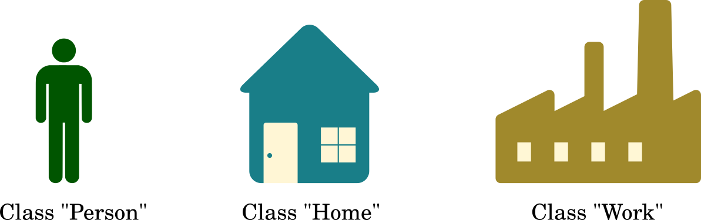
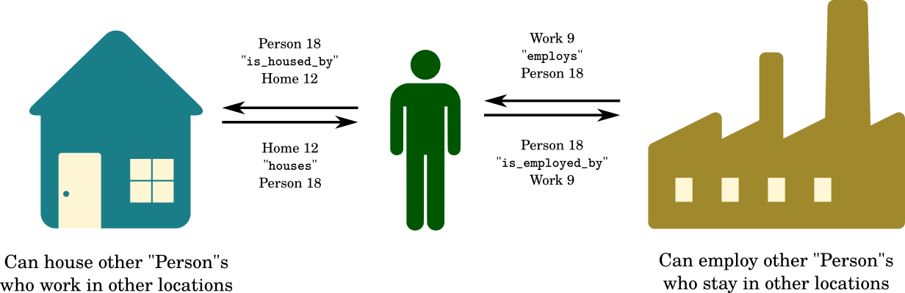
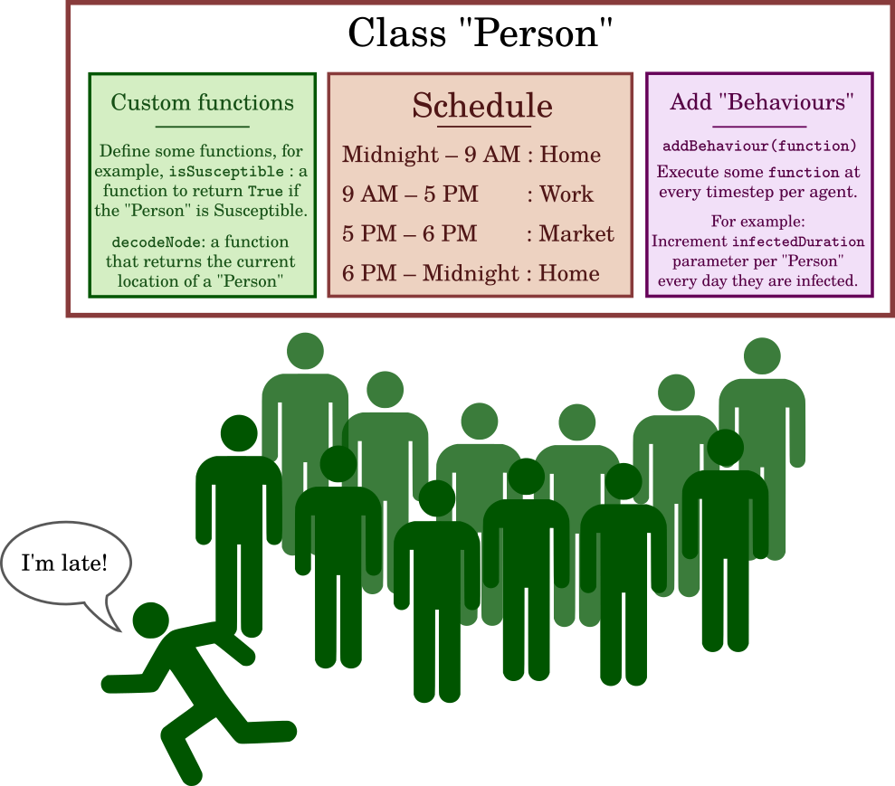
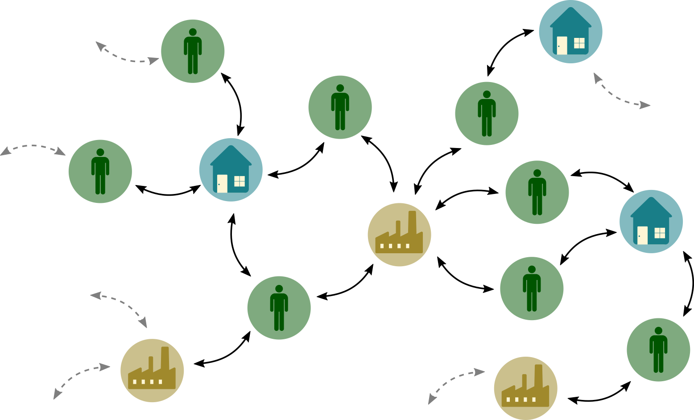
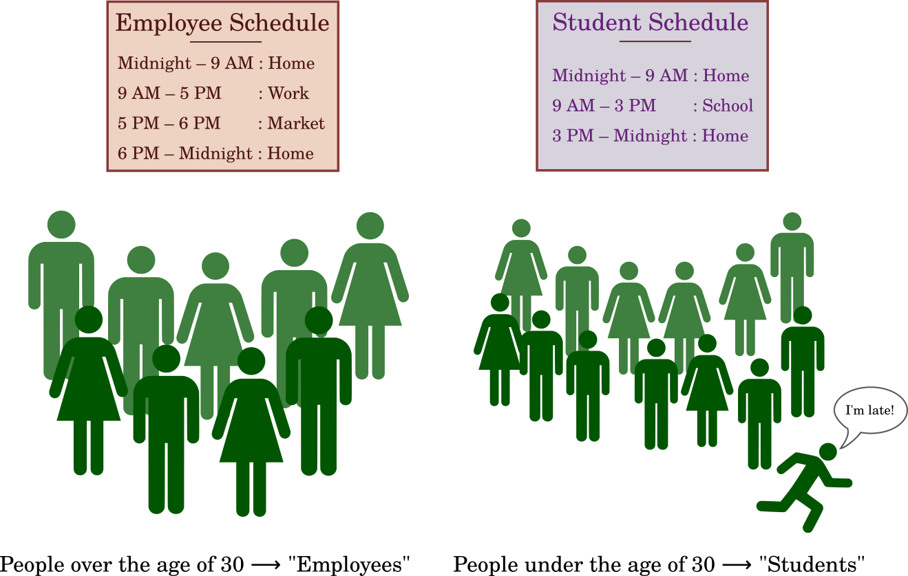

Components of the Simulation 
============================

The following sections aim to explain the basic components and terms used in the BharatSim Framework. Further information about the following can be gathered from the code provided and the other sections of the documentation. For the latter, the links will be placed.

Graph, Nodes and Relations
--------------------------

Graph is the basic data structure, in which data is stored. It is composed of different ``Nodes`` and ``Relations``. ``Node`` is the basic unit of the canvas (``Graph``) on which the simulation is built. There can be multiple nodes on the graph, and each of these nodes is specified by a unique 64-bit id. Each of these nodes is connected to each other by a ``Relation``. Only a single relation can exist between two ``Node``, and in case multiple relations are defined between two nodes, then the simulation will not know which ``Relation`` to pick, and hence will throw an error. In the framework, there are various functions present that can be used to obtain relations of one ``Node``, and can delete or update ``Relation`` and ``Nodes``. 

  Different User defined nodes present such as Person, Home, and Work. 

To illustrate the point, common ``Node`` in the BharatSim Framework are ``School``, ``Office``, and ``House``. Each of these Schools, Offices and Houses are connected to each other by user-defined ``Relations``. An example of ``Relations`` is when a Person ``works at`` Office, and the Office is an ``Employer of`` Person. Thus relations ``Works at`` and ``Employer of`` connects the ``Person`` and ``Office`` class. 

  Illustration of a bidirectional relationship between two nodes.

Agent and Behaviours
--------------------

``Agent`` is an extension of the ``Node`` class that was mentioned earlier, and  models the people in the simulation. In this type of programming, a system consists of a group of automatons that make decisions, based on appropriate probabilities,  at every time step and allow the simulation to progress further in time. In BharatSim, the agents are allowed to have basic attributes like occupations and age, and these attributes affect how the diseases progress in a population. 

At each time step, an agent may execute an action and these actions are called ``Behaviours``. These behaviours can be modelled depending on the situation the agent finds itself in. For example, if the agent has not contracted the disease, then they have a “choice” to get vaccinated at every time step, and whether they execute this choice is  dependent on a probability.  

Therefore, the ``Agent`` along with their ``behaviours`` mimic people in a population, and the more detailed the attributes and behaviours get, the better the mimicking will get. 

  Agents have can have custom Schedules and they can be made to execute actions through addBehaviour function.

Network
-------

A ``Network`` is established in BharatSim when two or more agent begin interacting with each other. Since BharatSim aims to simulate an infectious disease progressing in a population, the agents have to interact, making ``Network`` a crucial and central part of the simulation. A ``Network`` consists of Nodes and Agents, and determines the relations between them. For example, the network determines how a person is connected to their ``Office``, ``House``, and other ``Agents``, whether it be family members or colleagues. 

getContactProbability
^^^^^^^^^^^^^^^^^^^^^

In this class, there exists a function called ``getContactProbability`` that allows the programmer to get the probability of an agent being in contact with other agents in the same node. This is a crucial step in determining if the infection will spread and to how many people will it spread, if the said agents was infected. Similarly, it will dictate the number of infected agents this agent has interacted with, and hence the probability of contracting the infection. 

  A sample Graph consisting of nodes such as Person, Offices and Houses which are connected by relations, and forming a Network.

Schedules
---------

``Schedules`` are defined when a time component is added into a ``Network`` and determines the location of the agents in the ``Network`` at any instance of time. Each agent has to be present in some location in the Network at any given moment, and this is governed by the ``Schedule`` of the agent. To take a simple example, a Student’s schedule will be can be 0 - 9 Home, 9 - 17 School, 17 - 24 Home. Similarly, custom schedules can be created for any number of different types of people present in the population.

  Different types of Persons can have their own schedule based on age, jobs, and socio-economic status. 

Finite State Machine
--------------------

A Finite State Machine is a class of algorithms where an abstract machine can be in exactly one of the finite state at any given time. State is defined as the explicit trait of the system and this can be changed after satisfying a said boolean condition. This change from one state to another state is called a ``Transition``. The criteria for a ``Transition`` between two different pair of states may vary. This is best illustrated through an example of traffic lights. 

.. list-table:: Traffic Lights 
   :align: center
   :widths: 25 25 30
   :header-rows: 1

   * - Current State
     - Next State
     - Condition
   * - Green 
     - Yellow
     - 120 seconds
   * - Yellow 
     - Red
     - 20 seconds
   * - Red 
     - Green
     - 120 seconds

The above table lists the state the system can be in and the possible ``Transition`` condition that needs to be satisfied. Say the system just entered the Green State, then this implies that are after spending 120 seconds being Green, the system will transition to the Yellow State. 

Actions 
^^^^^^^

``EnterAction`` is an action an agent executes on entering a new state only. This is usually updating the state of the agent on ``Transitions``. For example, an Agent transitioned from the ``Exposed`` to ``Infected`` state, then the enter action would be update state to ``Infected``. 

There are a different class of actions that are executed at every time step of the simulation and this is type of action is know as ``PerTickAction``. Say an agent is in the ``Susceptible`` state, then test of infection is a ``PerTickAction``. 

Stateful Agent
^^^^^^^^^^^^^^

In analogy to the previous method of computation, the FSM incorporates a ``StatefulAgent`` in place of an ``Agent``. The function of both them is the same, that is to mimic the behaviour of the individuals in the population, however the method in which they execute their functions is different. Like we discussed earlier, the ``Agent`` has certain attributes like ``age``, ``occupation`` that are assigned while generating a dummy population, and this does not change in the ``StatefulAgent``. The manner in which the ``Agent`` and ``StatefulAgent`` deal with the infection status is unique, the former treating it as a parameter and the latter incorporating it as an explicit state. This is evident when the infection state has to be change, an ``Agent`` requires an ``updateParam`` whereas the ``StatefulAgent`` requires a ``Transition``. 