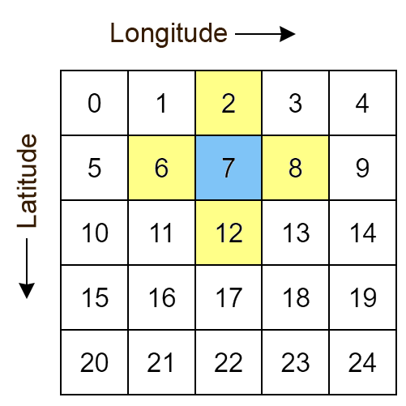
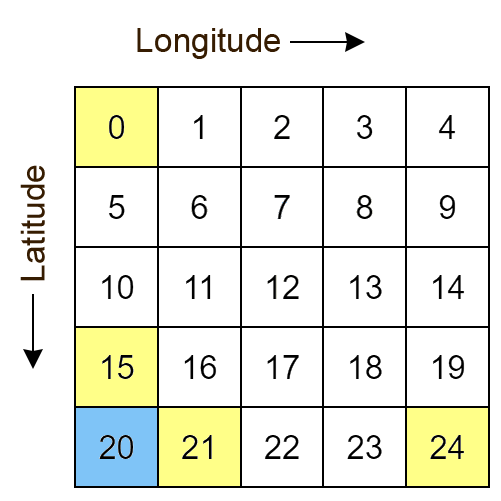
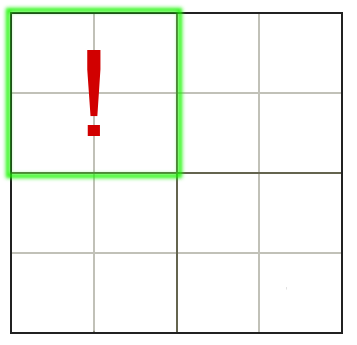

Other examples
==============

Houses on a lattice
-------------------

The model discussed earlier has no sense of geography: each house and office is practically isolated from all the others, as you can only infect people in your location. A simple way to try to introduce this into the model is by using houses on a grid, with the following characteristics:

* Houses are arranged periodically in rows and columns
* Each house has 4 nearest neighbours - namely the houses north, south, east, and west of them
* Assume that people in a house can only infect their nearest neighbours
* The inhabitants of a house are less likely to infect their neighbours than they are to their housemates

  The lattice of houses - each square represents a house. Here, houses 2,6,8 and 12 are neighbours of 7, and could potentially infect or get infected by it.

To simplify what happens at the boundaries, we implement *periodic boundary conditions*. This means the left edge and the right edge are identified, and likewise for the top and bottom edges of the lattice. Apart from being easy to implement, a system with periodic bondary conditions can be thought of as one which feels the influence of it's environment, rather than being isolated.

  With periodic boundary conditions, house 24 is now to the left of 20, and 0 is below 20.

We use a 50 × 50 lattice, which totals to 2500 houses. We can also add an intervention to the model, to make it more realistic. If we divide the lattice into larger 'blocks' of 100 houses each, so that a 5 × 5 arrangement of 25 blocks gives us our original lattice.

.. note:: The implementation below uses a ``block`` attribute in the house class. The blocks are numbered in the same way the houses are.

We can keep track of the number of infected in each block, and block it off if the infected count rises too high.

  Splitting if we split a 4 × 4 lattice into 4 blocks, we can see the boundary cordoned off if block 1 has a large number of infected.

We shall cordon off a block in the following way:

* If ``infectedCountToTriggerBlockade`` is above a threshold (we use 30), then the block needs to be closed off
* The block is closed off for ``blockadeDuration`` from the instant where the threshold is breached, regardless of the current levels of infected
* After the block comes out of the blockade, it cannot get locked down again for ``blockadeCooldown`` days, regardless of the current levels of infected

Rather than having the initial infected people spread around, we'll set them to be clustered in an area to better see the spread. We'll set the four corners as the infected area: despite looking like 4 separate regions they're actually all connected due to the periodic boundary conditions.

The main class is the following:

.. code-block:: scala

  package com.bharatsim.examples.epidemiology.latticeSIRTest

  import com.bharatsim.engine.ContextBuilder._
  import com.bharatsim.engine._
  import com.bharatsim.engine.actions.StopSimulation
  import com.bharatsim.engine.basicConversions.decoders.DefaultDecoders._
  import com.bharatsim.engine.basicConversions.encoders.DefaultEncoders._
  import com.bharatsim.engine.dsl.SyntaxHelpers._
  import com.bharatsim.engine.execution.Simulation
  import com.bharatsim.engine.graph.ingestion.{GraphData, Relation}
  import com.bharatsim.engine.graph.patternMatcher.MatchCondition._
  import com.bharatsim.engine.intervention.{IntervalBasedIntervention, SingleInvocationIntervention}
  import com.bharatsim.engine.listeners.{CsvOutputGenerator, SimulationListenerRegistry}
  import com.bharatsim.engine.models.{Agent, Node}
  import com.bharatsim.examples.epidemiology.latticeSIRTest.DiseaseStates.{InfectedState, SusceptibleState}
  import com.bharatsim.examples.epidemiology.latticeSIRTest.InfectionStatus._
  import com.typesafe.scalalogging.LazyLogging

  import java.util.Date

  object Main extends LazyLogging {

    final val numberOfTicksInADay: Int = 2
    final val dt: Double = 1/numberOfTicksInADay.toFloat

    private val myTick: ScheduleUnit = new ScheduleUnit(1)
    private val myDay: ScheduleUnit = new ScheduleUnit(myTick * numberOfTicksInADay)

    var isBlockadedList = new Array[Boolean](25)

    def main(args: Array[String]): Unit = {
      var beforeCount = 0
      val simulation = Simulation()

      simulation.ingestData(implicit context => {
        ingestCSVData("citizen10kLattice.csv", csvDataExtractor)
        logger.debug("Ingestion done")
      })

      simulation.defineSimulation(implicit context => {
        create12HourSchedules()

        blockadeBlock

        registerAction(
          StopSimulation,
          (c: Context) => {
            getInfectedCount(c) == 0
          }
        )

        beforeCount = getInfectedCount(context)

        registerAgent[Person]

        val currentTime = new Date().getTime

        SimulationListenerRegistry.register(
          new CsvOutputGenerator("src/main/resources/GISInfectedoutput_"+currentTime+".csv", new GISOutputSpecI(context))
        )
      })

      simulation.onCompleteSimulation { implicit context =>
        printStats(beforeCount)
        teardown()
      }

      val startTime = System.currentTimeMillis()
      simulation.run()
      val endTime = System.currentTimeMillis()
      logger.info("Total time: {} s", (endTime - startTime) / 1000)
    }

    private def blockadeBlock(implicit context: Context): Unit = {

      val interventionName = "blockade"
      val infectedCountToTriggerBlockade = 30
      val blockadeDuration = 7 * numberOfTicksInADay
      val blockadeCooldown = 7 * numberOfTicksInADay
      var ticksSinceBlockade = Array.fill(25){0}

      def perTickAction(context: Context): Unit = {
        for (i <- 0 to 24)  {

          if (ticksSinceBlockade(i) == blockadeDuration) {
            isBlockadedList(i) = false
          }

          if (ticksSinceBlockade(i) >= blockadeDuration + blockadeCooldown) {
            var infectedCountPerBlock: Long = 0
            var nodesInBlock = context.graphProvider.fetchNodes("House", "block" equ i)
            nodesInBlock.foreach(blockNode => {
              var tempvariable = fetchInfectedAndTotalPerLocation(blockNode.as[House], "House", context)
              infectedCountPerBlock += tempvariable._1.toLong
            }
            )

            if (infectedCountPerBlock >= infectedCountToTriggerBlockade) {
              isBlockadedList(i) = true
              ticksSinceBlockade(i) = 0
            }

          }
          else ticksSinceBlockade(i) += 1
        }
      }

      def fetchInfectedAndTotalPerLocation(node: Node, placeType: String, context: Context): (Double, Double) = {
        val cache = context.perTickCache
        val uniquekey = (placeType, node.internalId)
        cache.getOrUpdate(uniquekey, () => computeInfectedAndTotalPerLocation(node)).asInstanceOf[(Double, Double)]
      }

      def computeInfectedAndTotalPerLocation(node: Node): (Double, Double) = {
        val totalNeighbourCount = node.getConnectionCount(node.getRelation[Person]().get)
        if (totalNeighbourCount == 0)
          return (0d, 1)  // toDo change to (0,0), add check for dividing by 0
        val infectedNeighbourCount = node.getConnectionCount(node.getRelation[Person]().get,
          "infectionState" equ Infected)
        return (infectedNeighbourCount.toDouble, totalNeighbourCount.toDouble)
      }

      val intervention =
        IntervalBasedIntervention(interventionName, 1, 5000, whenActiveActionFunc = perTickAction)

      registerIntervention(intervention)
    }

    private def create12HourSchedules()(implicit context: Context): Unit = {

      val stayHomeSchedule = (myDay, myTick)
        .add[House](0, 1)

      registerSchedules(
        (stayHomeSchedule, (agent: Agent, _:Context) => agent.asInstanceOf[Person].age > 0, 1)
      )
    }

    private def csvDataExtractor(map: Map[String, String])(implicit context: Context): GraphData = {

      val citizenId = map("Agent_ID").toLong
      val age = map("Age").toInt

      val homeId = map("HHID").toLong
      val schoolId = map("school_id").toLong
      val officeId = map("WorkPlaceID").toLong
      val houseLatitude = map("H_Lat").toString
      val houseLongitude = map("H_Lon").toString

      val initialInfectionState = if ((houseLatitude=="0" || houseLatitude=="1" || houseLatitude=="49" ||
        houseLatitude=="2" || houseLatitude=="48") && (houseLongitude=="0" || houseLongitude=="1" || houseLongitude=="49" ||
        houseLongitude=="2" || houseLongitude=="48")) "Infected" else "Susceptible"

      val citizen: Person = Person(
        citizenId,
        age,
        houseLatitude,
        houseLongitude,
        InfectionStatus.withName(initialInfectionState),
        0,
        getInitialRecoveryTick(initialInfectionState)
      )

      if (initialInfectionState == "Susceptible") {
        citizen.setInitialState(SusceptibleState())
      }
      else
        citizen.setInitialState(InfectedState())

      val home = House(homeId, getHouseBlock(homeId))
      val staysAt = Relation[Person, House](citizenId, "STAYS_AT", homeId)
      val memberOf = Relation[House, Person](homeId, "HOUSES", citizenId)

      val neighboursLeft = Relation[House, House](homeId, "NEIGHBOURS", getLeftNeighbour(homeId))
      val neighboursRight = Relation[House, House](homeId, "NEIGHBOURS", getRightNeighbour(homeId))
      val neighboursUp = Relation[House, House](homeId, "NEIGHBOURS", getUpNeighbour(homeId))
      val neighboursDown = Relation[House, House](homeId, "NEIGHBOURS", getDownNeighbour(homeId))

      val graphData = GraphData()
      graphData.addNode(citizenId, citizen)
      graphData.addNode(homeId, home)
      graphData.addRelations(staysAt, memberOf)

      var lHomeId = getLeftNeighbour(homeId)
      var rHomeId = getRightNeighbour(homeId)
      var uHomeId = getUpNeighbour(homeId)
      var dHomeId = getDownNeighbour(homeId)

      graphData.addNode(lHomeId, House(lHomeId, getHouseBlock(lHomeId)))
      graphData.addNode(rHomeId, House(rHomeId, getHouseBlock(rHomeId)))
      graphData.addNode(uHomeId, House(uHomeId, getHouseBlock(uHomeId)))
      graphData.addNode(dHomeId, House(dHomeId, getHouseBlock(dHomeId)))

      graphData.addRelations(staysAt, memberOf)
      graphData.addRelations(neighboursLeft, neighboursRight, neighboursUp, neighboursDown)

      if (age >= 25) {
        val office = Office(officeId)
        val worksAt = Relation[Person, Office](citizenId, "WORKS_AT", officeId)
        val employerOf = Relation[Office, Person](officeId, "EMPLOYER_OF", citizenId)

        graphData.addNode(officeId, office)
        graphData.addRelations(worksAt, employerOf)
      } else {
        val school = School(schoolId)
        val studiesAt = Relation[Person, School](citizenId, "STUDIES_AT", schoolId)
        val studentOf = Relation[School, Person](schoolId, "STUDENT_OF", citizenId)

        graphData.addNode(schoolId, school)
        graphData.addRelations(studiesAt, studentOf)
      }

      graphData
    }

    private def getLeftNeighbour(houseID: Long) : Long = {
      if ((houseID + 1) % 50 == 0 ) {
        houseID + 1 - 50
      }
      else houseID + 1
    }

    private def getRightNeighbour(houseID: Long) : Long = {
      if (houseID % 50 == 0 ) {
        houseID - 1 + 50
      }
      else houseID - 1
    }

    private def getUpNeighbour(houseID: Long) : Long = {
      (houseID + 50) % 2500
    }

    private def getDownNeighbour(houseID: Long) : Long = {
      (houseID - 50 + 2500) % 2500
    }

    def getHouseBlock(houseID: Long) : Int = {
      val block_Lat = (houseID % 50) / 10
      val block_Lon = (houseID / 50) / 10
      5*block_Lat.toInt + block_Lon.toInt
    }

    private def printStats(beforeCount: Int)(implicit context: Context): Unit = {
      val afterCountSusceptible = getSusceptibleCount(context)
      val afterCountInfected = getInfectedCount(context)
      val afterCountRecovered = getRemovedCount(context)

      logger.info("Infected before: {}", beforeCount)
      logger.info("Infected after: {}", afterCountInfected)
      logger.info("Susceptible: {}", afterCountSusceptible)
      logger.info("Recovered: {}", afterCountRecovered)
    }

    private def getInitialRecoveryTick(state: String): Double = {
      if (state == "Susceptible") {
        0
      }
      else {
        numberOfTicksInADay*Disease.infectionDurationPDF.sample()
      }
    }

    private def getSusceptibleCount(context: Context) = {
      context.graphProvider.fetchCount("Person", "infectionState" equ Susceptible)
    }

    private def getInfectedCount(context: Context) = {
      context.graphProvider.fetchCount("Person", "infectionState" equ Infected)
    }

    private def getRemovedCount(context: Context) = {
      context.graphProvider.fetchCount("Person", "infectionState" equ Removed)
    }
  }

.. hint:: Here's a breakdown of the methods in the ``main`` class, and what they do.

  * ``blockadeBlock``: Defines and registers the intervention described above
  * ``create12HourSchedules``: Defines and registers the agent registerSchedules
  * ``csvDataExtractor``: Creates the graph using the inputted CSV file
  * ``getLeftNeighbour``, ``getRightNeighbour``, ``getUpNeighbour``, ``getDownNeighbour``: Take a houses' ID and returns the ID of the appropriate neighbour, after taking periodic boundary conditions into account
  * ``getHouseBlock``: Returns the block number a given house is part of

When it comes infection, the possibility of infecting others in neighbouring houses is taken care of in the ``fetchInfectedRatioForAllNeighbours`` method of the ``SusceptibleState`` class. It does the following:

* First, it calculates the number of infected and total people in the house itself.
* Then it loooks at every neighbour of the house.
* If the neighbour belongs to the same block, it adds that neighbour's infected and total person counts.
* If the neighbour doesn't belong to the block, it checks if the neighbours' block has been blockaded. If not, it adds the neighbour's infected and total person counts.
* Finally, it returns the ratio of the infected to total person count, which is used to check if the person gets infected.

The entire ``SusceptibleState`` class is given below:

.. code-block:: scala

  package com.bharatsim.examples.epidemiology.latticeSIRTest.DiseaseStates

  import com.bharatsim.engine.Context
  import com.bharatsim.engine.basicConversions.decoders.DefaultDecoders._
  import com.bharatsim.engine.basicConversions.encoders.DefaultEncoders._
  import com.bharatsim.engine.fsm.State
  import com.bharatsim.engine.graph.GraphNode
  import com.bharatsim.engine.graph.patternMatcher.MatchCondition._
  import com.bharatsim.engine.models.{Network, Node, StatefulAgent}
  import com.bharatsim.engine.utils.Probability.biasedCoinToss
  import com.bharatsim.examples.epidemiology.latticeSIRTest.InfectionStatus._
  import com.bharatsim.examples.epidemiology.latticeSIRTest.Main.{isBlockadedList, dt, numberOfTicksInADay}
  import com.bharatsim.examples.epidemiology.latticeSIRTest.{Disease, House, Office, Person, School}
  import com.bharatsim.examples.epidemiology.latticeSIRTest.DiseaseStates.InfectedState

  case class SusceptibleState() extends State {

    override def enterAction(context: Context, agent: StatefulAgent): Unit = {
      agent.updateParam("infectionState", Susceptible)
    }

    def shouldBeInfected(context: Context, agent: StatefulAgent): Boolean = {
      val exposureProbability = Disease.lambda_s * dt

      val schedule = context.fetchScheduleFor(agent).get

      val currentStep = context.getCurrentStep
      val placeType: String = schedule.getForStep(currentStep)
      val places = agent.getConnections(agent.getRelation(placeType).get).toList
      if (places.nonEmpty) {
        val place = places.head
        val decodedPlace = decodeNode(placeType, place)

        val infectedNeighbourFraction = fetchInfectedRatioForAllNeighbours(decodedPlace, placeType, context)

        if (biasedCoinToss(exposureProbability * infectedNeighbourFraction)) {
          agent.updateParam("RecoveryTick", context.getCurrentStep.toDouble + numberOfTicksInADay * Disease.infectionDurationPDF.sample())
          true
        }
        else false

      }
      else false
    }

    def fetchInfectedRatioForAllNeighbours(node:Node, placeType: String, context: Context): Double = {
      val neighbourList = node.getConnections("NEIGHBOURS")
      var temp_return = fetchInfectedAndTotalPerLocation(node, placeType, context)
      var neighbouringInfectedNumber = temp_return._1
      var neighbouringTotalNumber = temp_return._2
      if (neighbourList.nonEmpty) {
        neighbourList.foreach(neighbouringNode => {
          if (node.asInstanceOf[House].block == neighbouringNode.as[House].block) {
            var temp_return2 = fetchInfectedAndTotalPerLocation(neighbouringNode.as[House], placeType, context)
            neighbouringInfectedNumber += temp_return2._1
            neighbouringTotalNumber += temp_return2._2
          }
          else if (! isBlockadedList(neighbouringNode.as[House].block)) {
            var temp_return2 = fetchInfectedAndTotalPerLocation(neighbouringNode.as[House], placeType, context)
            neighbouringInfectedNumber += temp_return2._1
            neighbouringTotalNumber += temp_return2._2
          }
        })
      }
      neighbouringInfectedNumber.toDouble / neighbouringTotalNumber.toDouble
    }

    def fetchInfectedAndTotalPerLocation(node: Node, placeType: String, context: Context): (Double, Double) = {
      val cache = context.perTickCache
      val uniquekey = (placeType, node.internalId)
      cache.getOrUpdate(uniquekey, () => computeInfectedAndTotalPerLocation(node)).asInstanceOf[(Double, Double)]
    }

    def computeInfectedAndTotalPerLocation(node: Node): (Double, Double) = {
        val totalNeighbourCount = node.getConnectionCount(node.getRelation[Person]().get)
        if (totalNeighbourCount == 0)
          return (0d, 1)  // toDo change to (0,0), add check for dividing by 0
        val infectedNeighbourCount = node.getConnectionCount(node.getRelation[Person]().get,
          "infectionState" equ Infected)
        return (infectedNeighbourCount.toDouble, totalNeighbourCount.toDouble)
    }

    def decodeNode(classType: String, node: GraphNode): Node = {
      classType match {
        case "House" => node.as[House]
        case "Office" => node.as[Office]
        case "School" => node.as[School]
      }
    }

    addTransition(
      when = shouldBeInfected,
        to = context => InfectedState()
    )

  }

The output is taken care of with the ``GISOutputSpecI``, as mentioned in the ``main`` function. This function outputs the coordinates of each house, along with the number of infected inside it. It also has a column which tells us which blocks are infected. You can have a look at the class below:

.. code-block:: scala

  package com.bharatsim.examples.epidemiology.latticeSIRTest

  import com.bharatsim.engine.Context
  import com.bharatsim.engine.basicConversions.decoders.DefaultDecoders._
  import com.bharatsim.engine.graph.patternMatcher.MatchCondition._
  import com.bharatsim.engine.listeners.CSVSpecs
  import com.bharatsim.examples.epidemiology.latticeSIRTest.InfectionStatus._
  import com.bharatsim.examples.epidemiology.latticeSIRTest.Main.isBlockadedList

  import scala.collection.mutable
  import scala.collection.mutable.ListBuffer

  class GISOutputSpecI(context: Context) extends CSVSpecs {

    override def getHeaders: List[String] = List("Step", "latitude", "longitude", "infectedCount", "blockadedBlocks")

    private def roundLatLong(lat: String, long: String): (Double, Double) = {
      val scale = 1
      (
        BigDecimal(lat).setScale(scale, BigDecimal.RoundingMode.DOWN).toDouble,
        BigDecimal(long).setScale(scale, BigDecimal.RoundingMode.DOWN).toDouble
      )
    }

    override def getRows(): List[List[Any]] = {
      if (context.getCurrentStep % 2 == 0) {
        val label = "Person"
        val countByLatLong = new mutable.HashMap[(Double, Double), Int]()

        val people = context.graphProvider.fetchNodes(
          label,
          ("infectionState" equ Infected)
        )

        people.foreach((p) => {
          val person = p.as[Person]
          val latLong = roundLatLong(person.lat, person.long)
          val infectedCount = countByLatLong.getOrElseUpdate(latLong, 0)
          countByLatLong.put(latLong, infectedCount + 1)
        })

        val blockadedBlocks = isBlockadedList.zipWithIndex.filter(pair => pair._1).map(pair => pair._2)
        // divides the list into pairs with (truthvalue, index).Then checks if pair._1 is true, if so it returns the index

        val rows = ListBuffer.empty[List[String]]
        countByLatLong.toList.foreach((kv) => {
          val latLong = kv._1
          val count = kv._2
          rows.addOne(List(context.getCurrentStep.toString, latLong._1.toString, latLong._2.toString, count.toString,
            blockadedBlocks.mkString("(", ", ", ")")))
        })
        return rows.toList
      } else {
        List.empty
      }
    }
  }

